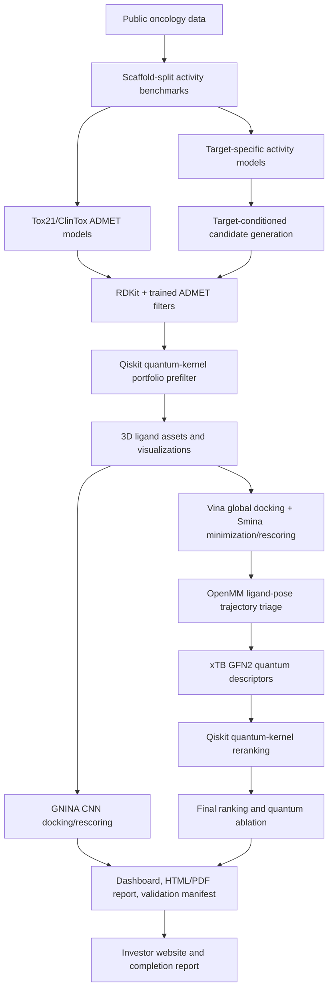

# Q-AI Cancer Drug Discovery Platform

Quantum-augmented AI research pipeline for oncology hit discovery across EGFR(Epidermal Growth Factor Receptor), PARP1(Poly(ADP-ribose) Polymerase 1), and PIK3CA(Phosphatidylinositol-4,5-bisphosphate 3-Kinase Catalytic Subunit Alpha).

This repository converts the original notebook work and the project process PDF into a package-based, CMake-orchestrated research system. It is designed to produce reproducible computational candidate hypotheses, not therapeutic claims.

## Current Verified Status

Last validated locally on Windows with WSL:

- Vina: available through WSL, smoke-tested with mini docking.
- Smina: available through WSL, smoke-tested with mini docking.
- GNINA: available through WSL with CUDA/cuDNN runtime libraries, smoke-tested with CNN score-only and run on top candidates.
- OpenBabel: available through WSL, smoke-tested for SDF/PDBQT conversion.
- xTB: available through WSL, smoke-tested with a real GFN2 single-point calculation.
- RDKit, OpenMM, Qiskit, py3Dmol, FastAPI: installed in the Python research environment.
- Full cached research run completed under CMake.
- Reusable trained models are saved under `models/activity/` and `models/admet/`.
- Early Qiskit statevector quantum-kernel portfolio prefiltering is active before docking/QM.
- Real GNINA CPU CNN docking/rescoring is available from CMake, CLI, and the dashboard with quick/investor/scientific depth modes.
- Dashboard artifact health now reports the active API origin/output directory, top-30 image coverage, docked-pose coverage, and GNINA pose coverage.
- The 3D workbench defaults to Vina/Smina docked SDF poses, with GNINA and RDKit conformer fallbacks labelled by method tier.
- The experiment package runs 144 in silico ranking/safety/structure/quantum stress tests and writes a hybrid top-5 computational hit package.
- Unit tests pass.
- Proof-tier artifact validation passes with zero warnings on the active artifact set.
- Research-evidence artifact validation passes with zero warnings on the active artifact set.
- Strict scientific hardening artifacts are generated: dataset curation reports, scaffold-split baseline comparisons, actives-vs-decoys enrichment tables, applicability-domain labels, medchem/ADMET risk tables, interaction fingerprints, quantum ablations, negative controls, claim matrix, and 30 candidate dossiers.

## Latest Science-First Runner Updates

The scientist-facing module runners now include stricter evidence-status handling for the standalone SaaS-style workflow. These updates are separate from the full CMake research pipeline and are intended to make per-user module runs more scientifically honest.

- `q_orbital_analyzer` now supports an explicit `allow_fallback` payload flag. `method=xtb` with `allow_fallback=false` fails rows when xTB is unavailable or fails, while `allow_fallback=true` permits RDKit Extended Huckel fallback. Each output row carries a `qm_status` such as `xtb_success`, `eht_fallback`, `failed_xtb`, `failed_eht`, or `failed_xtb_no_fallback`.
- `q_dock_studio` now records `requested_engine`, `actual_engine_used`, and `gnina_executed=false` in the standalone runner. The runner does not overclaim GNINA execution unless a dedicated GNINA path is actually wired. Mock docking rows are marked as non-evidence and are suitable only for plumbing/fallback tests.
- `q_dock_studio` now emits explicit `interaction_fingerprints.csv` and `redocking_validation.csv` artifacts when relevant. These are honest placeholders until full receptor-pose contact parsing and reference-ligand RMSD redocking are implemented.
- `q_rank` is routed to `q_ai_drug.product.module_runners.q_rank_scientific.QRankRunner`. This evidence-aware runner consumes candidate, activity, docking, applicability-domain, and orbital/QM evidence artifacts, then penalizes mock docking, heuristic activity scores, EHT fallback, failed/missing QM, out-of-domain candidates, and missing evidence.
- Evidence-aware Q-Rank writes `ranked_candidates.csv`, `rank_explanations.csv`, `rank_ablation.csv`, `evidence_status_report.csv`, `missing_evidence_report.csv`, `weight_config_used.json`, and `q_rank_summary.json`.
- `q_report` is routed to `q_ai_drug.product.module_runners.q_report_scientific.QReportRunner`. It can consume ranked-candidate, wet-lab triage, evidence-status, and rank-ablation artifacts, then generates an evidence-aware report package.
- Evidence-aware Q-Report writes `selected_candidates.csv`, `claim_matrix.csv`, `report_ranked_candidates_subset.csv`, `report.md`, `report.html`, and `report_manifest.json`. The report explicitly separates real, fallback, mock, missing, and wet-lab-required evidence and prevents therapeutic overclaiming.
- `tests/test_scientific_runner_contracts.py` locks the lightweight Python contracts for strict Q-Orbital fallback behavior, Q-Dock GNINA-request preservation, evidence-aware Q-Rank routing, and evidence-aware Q-Report routing.

These updates improve scientific traceability for user-level runs. Remaining science-first work: full GNINA standalone execution or removal from standalone engine choices, real redocking RMSD computation, residue-level interaction fingerprints, and deeper Activity Model / Applicability Domain training-set integration.

Main report:

```text
outputs/cancer_proof_v1/report.html
outputs/cancer_proof_v1/report.pdf
```

Current local servers, when launched:

```text
http://127.0.0.1:8000/investor
http://127.0.0.1:8000/app
http://127.0.0.1:8000/dashboard
http://127.0.0.1:8010/report.html
http://127.0.0.1:8000/docs
```

## Start Backend And Frontend

The local demo uses one FastAPI process as the backend and static frontend host. The same server exposes the API, investor site, Discovery Console, completion report, model endpoints, and artifact downloads.

Start the backend and open the investor frontend:

```powershell
cmake --build --preset serve-investor
```

Start the backend and open the Discovery Console frontend:

```powershell
cmake --build --preset serve-dashboard
```

Start manually without CMake:

```powershell
python -m uvicorn q_ai_drug.service.api:app --host 127.0.0.1 --port 8000
```

Then open:

```text
http://127.0.0.1:8000/investor
http://127.0.0.1:8000/app
http://127.0.0.1:8000/dashboard
http://127.0.0.1:8000/completion-report
http://127.0.0.1:8000/artifacts/report.html
http://127.0.0.1:8000/docs
```

Open `/app` for the working product app. It loads the full scientist module console directly. Use `Start Local Demo` to create a local account, connect the `cancer_proof_v1` project, switch tiers, dry-run all modules, run a selected module, and inspect job logs plus `module_result.json` artifacts.

On Windows, `scripts/serve_api.ps1` automatically chooses the next free port if `8000` is busy and writes the active URL to:

```text
outputs/api_server.json
```

If the dashboard shows `No Run` or zero candidates, check that browser URL against `outputs/api_server.json` and the dashboard artifact-health banner. A stale server on another port can serve an old frontend while the current artifact directory is healthy.

Useful HTTP checks:

```powershell
Invoke-RestMethod http://127.0.0.1:8000/research/artifact-health
Invoke-RestMethod "http://127.0.0.1:8000/research/top-candidates?limit=30"
Invoke-RestMethod "http://127.0.0.1:8000/research/pose-viewer-data?limit=30"
```

Docker Compose product topology:

```powershell
docker compose up --build
```

This starts the API/frontend container plus PostgreSQL, Redis, MinIO, and Redis/RQ worker containers for CPU, docking, GNINA, and quantum queues.

SaaS smoke flow after Compose starts:

```powershell
$signup = Invoke-RestMethod -Method Post http://127.0.0.1:8000/auth/signup -ContentType "application/json" -Body '{"email":"demo@example.com","password":"demo-password-123","organization_name":"Demo Org"}'
$headers = @{ Authorization = "Bearer $($signup.access_token)" }
$project = Invoke-RestMethod -Method Post http://127.0.0.1:8000/projects -Headers $headers -ContentType "application/json" -Body '{"name":"demo_project","config_path":"configs/cancer_targets.yaml"}'
$run = Invoke-RestMethod -Method Post "http://127.0.0.1:8000/projects/$($project.id)/runs" -Headers $headers -ContentType "application/json" -Body (@{ project_id = $project.id; dry_run = $true } | ConvertTo-Json)
Invoke-RestMethod "http://127.0.0.1:8000/runs/$($run.id)/logs" -Headers $headers
```

## One-Command Workflows

Full research workflow with data download/cache, setup, tool checks, pipeline run, report rebuild, and proof-tier validation:

```powershell
cmake --workflow --preset research
```

Install or repair WSL tools first, then run the full research workflow:

```powershell
cmake --workflow --preset research-bootstrap
```

Run from cached datasets:

```powershell
cmake --workflow --preset offline-research
```

Download datasets and train only the reusable activity plus ADMET models into `models/`:

```powershell
cmake --workflow --preset train-models
```

Run GNINA CNN docking/rescoring on the current top candidates:

```powershell
cmake --workflow --preset run-gnina
```

Run the 100+ experiment matrix and hybrid consensus package:

```powershell
cmake --build --preset run-experiments
```

Build the strict scientific study artifacts over an existing run:

```powershell
python -m q_ai_drug.research.scientific_study --project outputs/cancer_proof_v1 --config configs/cancer_targets.yaml
```

GNINA depth defaults to `quick` (top 1 per target). Configure a deeper run before building:

```powershell
cmake --preset offline -DQAI_GNINA_DEPTH_MODE=investor -DQAI_GNINA_TOP_PER_TARGET=3
cmake --build --preset run-gnina
```

Fast local smoke workflow with fewer generated molecules:

```powershell
cmake --workflow --preset quick-research
```

Open the report and API after a cached run:

```powershell
cmake --workflow --preset show
```

Open only the dashboard frontend:

```powershell
cmake --build --preset serve-dashboard
```

Build the investor package and open the investor site:

```powershell
cmake --workflow --preset investor-demo
```

Build only the completion report and readiness JSON:

```powershell
cmake --workflow --preset investor-package
```

Run unit tests plus proof-tier artifact validation:

```powershell
cmake --workflow --preset test-all
```

With the backend already running, smoke-check the API and static dashboard:

```powershell
cmake --build --preset smoke-ui-api
```

## Setup Details

Install Python research extras:

```powershell
pip install -e ".[research]"
```

Install or repair WSL tools:

```powershell
cmake --preset default
cmake --build --preset install-tools
```

For non-interactive sudo, set `WSL_SUDO_PASSWORD` only in the current shell session. Do not commit credentials.

Manual tool checks:

```powershell
python scripts/verify_external_tools.py --strict
python scripts/smoke_external_tools.py
```

## Pipeline



## Product and Investor Demo

The browser product layer now has two entry points:

- `/investor`: public investor website with proof metrics, tool-suite explanation, cancer proof target coverage, quantum differentiation, demo flow, and links into the console.
- `/app`: main working product app for authenticated projects, tier testing, module execution, usage, job logs, and module result artifacts.
- `/dashboard`: Discovery Console for target workspaces, candidates, model access, quantum/QM tables, scientific evidence mapping, GNINA live runs, closeable docked-pose viewing, a project-scoped scientist module console, community tool status, validation gates, and investor proof metrics.

The API exposes product-ready endpoints for investor and model access:

```text
GET  /research/investor-metrics
GET  /research/product-readiness
GET  /research/demo-flow
GET  /research/artifact-health
GET  /research/target-workspace
GET  /research/experiments
GET  /research/scientific-evidence
GET  /research/top-candidates
GET  /research/pose-viewer-data
POST /auth/signup
POST /auth/login
GET  /auth/me
POST /auth/api-keys
DELETE /auth/api-keys/{api_key_id}
POST /models/predict
POST /models/batch-predict
POST /projects
GET  /projects
POST /projects/{project_id}/runs
GET  /runs/{run_id}
GET  /runs/{run_id}/logs
GET  /runs/{run_id}/candidates
GET  /v1/tools
GET  /projects/{project_id}/tools
POST /projects/{project_id}/tools/{module_id}/estimate
POST /projects/{project_id}/tools/{module_id}/run
GET  /projects/{project_id}/module-runs
GET  /projects/{project_id}/module-runs/{run_id}/result
GET  /projects/{project_id}/files/{file_path}
POST /projects/{project_id}/uploads
POST /projects/{project_id}/uploads/molecules
POST /projects/{project_id}/uploads/receptor
GET  /api/artifacts/{artifact_id}
GET  /api/artifacts/{artifact_id}/download
```

Generated investor artifacts:

```text
docs/project_completion_report.md
outputs/cancer_proof_v1/project_completion_report.html
outputs/cancer_proof_v1/product_readiness_report.json
```

Docker Compose demo deployment is defined in `docker-compose.yml` with API, CPU/docking/GNINA/quantum RQ workers, PostgreSQL, Redis, and MinIO. Read `docs/product_deployment.md` for the current deployment boundary and hardening checklist.

## What Is Real Today

The active run includes:

- Public dataset retrieval and caching for ChEMBL, PubChem, RCSB/AlphaFold structures, Tox21, and ClinTox.
- Scaffold-split model training for EGFR, PARP1, and PIK3CA.
- Trainable Tox21/ClinTox ADMET classifiers saved in `models/admet/` and used in filtering/ranking.
- Early Qiskit statevector quantum-kernel prefiltering over filtered candidates, used to prioritize the docking portfolio and final ranking.
- Reference-inhibitor rediscovery metrics.
- Strict curation layer for public activity rows with assay confidence, standardized activity fields, curation flags, and per-target summary tables.
- Scaffold-split baseline comparison across ECFP logistic regression, ECFP random forest, RDKit ExtraTrees, HistGradientBoosting, and similarity-to-known-actives baselines.
- Known actives-vs-decoys enrichment summaries with EF1/5/10, PR-AUC, ROC-AUC, top-k active recovery, and calibration curves.
- Applicability-domain labels for every top candidate using nearest training/active/reference-drug similarity and scaffold novelty.
- Target-conditioned candidate generation and filtering.
- Generation validity, uniqueness, diversity, and novelty reports.
- Medicinal chemistry risk classes with SA proxy, alert counts, covalent/reactive flags, aggregator proxy, chelator proxy, and frequent-hitter flags.
- Candidate-level ADMET risk tables with endpoint-level toxicity probabilities instead of only aggregate ADMET scores.
- RDKit 2D/3D ligand assets and molecule galleries.
- Real AutoDock Vina global docking for 300 selected candidates, with prepared PDBQT receptors/ligands, pose outputs, logs, and Smina local minimization/rescoring.
- Curated-pocket GNINA pose interaction fingerprints for the top 30 candidates; all active top candidates currently have plausible key-pocket contact fingerprints in the active artifact set.
- Real OpenMM CPU trajectory artifacts for the top 10 docked candidates per target.
- Real GNINA CPU CNN docking/rescoring with quick/investor/scientific depth modes, SDF pose artifacts, warning parsing, and live dashboard logs.
- Real xTB GFN2 single-point calculations for top candidates.
- Real Qiskit statevector quantum-kernel reranking.
- Multi-engine Vina/GNINA redocking validation now records per-engine RMSD and uses best-mode reference-ligand pose recovery for the scientific gate.
- `references.bib` now tracks 80 recent 2020-2026 papers/reports across biomolecular foundation models, docking, generative design, ADMET, xTB/QM, and quantum machine learning.
- AlphaFold receptor structures for EGFR/PARP1/PIK3CA are served to the dashboard 3D viewer.
- `configs/oncology_pockets.yaml` records pocket center/size/provenance and feeds Vina/Smina/GNINA runs. Current entries use co-crystal pocket anchors for EGFR `1M17`, PARP1 `7KK4`, and PIK3CA `7MYO`; redocking RMSD is reported separately.
- `outputs/cancer_proof_v1/experiments/` contains the 144-experiment stress-test matrix, hybrid consensus CSVs, figures, and experiment report.
- `outputs/cancer_proof_v1/platform/module_registry.json` registers the 18 scientist workflow modules with schemas, queues, tier policy, credit estimators, quality gates, and claim boundaries.
- `outputs/cancer_proof_v1/platform/module_execution_matrix.csv` and `platform/module_result_schema.json` define the executable dry-run/small/production module layer and standardized `module_result.json` contract.
- `outputs/cancer_proof_v1/inhibitors/` contains the reference-inhibitor registry, candidate proximity report, and inhibitor comparison dossier.
- `outputs/cancer_proof_v1/triage/wet_lab_triage_board.csv` classifies all available ranked candidates without a hard top-N limit and includes reasons to test and reasons not to test.
- `outputs/cancer_proof_v1/candidate_evidence/candidate_evidence.jsonl` exports MongoDB-shaped candidate evidence documents for SaaS ingestion.
- `outputs/cancer_proof_v1/candidate_dossiers/` contains top-10-per-target candidate dossiers with "why it may fail" and next validation sections.
- `outputs/cancer_proof_v1/scientific_claim_matrix.csv` separates Level 0/1/2 computational hypotheses from Level 3 experimental hits, which remain unavailable until wet-lab data exist.
- Legacy ADA/ALDR/CAH2/TRY1/TRYB1 AlphaFold structures are kept under `data/structures_havetosee/` for review only.
- Final ranking with quantum ablation columns.
- HTML/PDF report generation.
- Tool manifests, smoke-test manifests, model cards, run manifests, validation reports.

The current proof run produced:

```text
benchmark_records: 2542
generated_candidates: 15000
filtered_candidates: 1500
docking_rows: 300
docking_real: true
md_rows: 30
md_real: true
qm_rows: 30
qml_rows: 30
gnina_rows: 30
ranked_rows: 300
```

## Current Limitations

The software artifact gate and research evidence gate pass with zero gate warnings in the active artifact set, but this is still computational research evidence rather than therapeutic validation or SaaS production readiness.

- Vina/Smina/OpenBabel are installed, smoke-tested, and used in the main docking table. Older main docking rows may have been generated before curated pocket reruns; the pocket registry and GNINA use co-crystal anchors.
- GNINA is installed and artifact-backed for selected top candidates with curated pocket anchors and centered ligand inputs; warning parsing is surfaced in the dashboard.
- Redocking validation is multi-engine: the gate records Vina and GNINA RMSD separately and requires the best validated engine to recover reference ligand poses below 2 A.
- OpenMM is active and writes trajectory artifacts for docked ligand poses. It is a real OpenMM ligand-pose relaxation/stability screen, not an explicit-solvent, fully parameterized protein-ligand MD/FEP workflow.
- xTB and Qiskit are active in the main run and are validated by the proof-tier gate.

Use:

```powershell
python scripts/validate_research_artifacts.py --project outputs/cancer_proof_v1 --tier proof
```

The stricter research-evidence gate is:

```powershell
python scripts/validate_research_artifacts.py --project outputs/cancer_proof_v1 --tier production
```

The research evidence gate should now return `pass` with zero warnings on the active artifact set. The SaaS production gate remains in progress until auth, object storage, hosted workers, quotas, and deployment operations are complete.

## Key Outputs

```text
data/processed/oncology_benchmark.csv
data/processed/reference_inhibitors.csv
models/activity/
models/admet/
outputs/cancer_proof_v1/generated.csv
outputs/cancer_proof_v1/filtered.csv
outputs/cancer_proof_v1/assets/ligand_asset_manifest.csv
outputs/cancer_proof_v1/curation/dataset_curation_summary.csv
outputs/cancer_proof_v1/benchmarks/enrichment_summary.csv
outputs/cancer_proof_v1/generation/generation_metrics.csv
outputs/cancer_proof_v1/docking/results.csv
outputs/cancer_proof_v1/docking/interaction_fingerprints.csv
outputs/cancer_proof_v1/gnina/results.csv
outputs/cancer_proof_v1/gnina/poses/
outputs/cancer_proof_v1/md/stability.csv
outputs/cancer_proof_v1/qm/qm_descriptors.csv
outputs/cancer_proof_v1/qm/qm_descriptor_summary.csv
outputs/cancer_proof_v1/qml/quantum_prefilter_scores.csv
outputs/cancer_proof_v1/qml/quantum_kernel_scores.csv
outputs/cancer_proof_v1/qml/quantum_ablation_benchmark.csv
outputs/cancer_proof_v1/ranking/weight_ablation.csv
outputs/cancer_proof_v1/medchem/medchem_risk_table.csv
outputs/cancer_proof_v1/admet/candidate_admet_risk_table.csv
outputs/cancer_proof_v1/controls/negative_control_results.csv
outputs/cancer_proof_v1/candidate_dossiers/
outputs/cancer_proof_v1/models/admet_model_metrics.csv
outputs/cancer_proof_v1/models/model_comparison.csv
outputs/cancer_proof_v1/models/applicability_domain.csv
outputs/cancer_proof_v1/final_ranked_candidates.csv
outputs/cancer_proof_v1/top_candidates.csv
outputs/cancer_proof_v1/scientific_claim_matrix.csv
outputs/cancer_proof_v1/strict_scientific_report.html
outputs/cancer_proof_v1/report.html
outputs/cancer_proof_v1/report.pdf
outputs/cancer_proof_v1/validation_report.json
```

## Research Architecture

Read:

```text
docs/research_architecture.md
docs/sota_review.md
docs/product_deployment.md
DATA_SOURCES.md
references.bib
```

The architecture tracks active components and near-term SOTA integrations:

- Biomolecular complex prediction and affinity comparison: AlphaFold 3, RoseTTAFold All-Atom, Chai-1, Boltz-1, Boltz-2, and FoldBench.
- Docking and rescoring: AutoDock Vina, Smina/Vinardo, DiffDock, GNINA 1.3, Folding-Docking-Affinity-style workflows.
- Molecular representation: Uni-Mol and 3D pretrained molecular encoders.
- Generative chemistry: REINVENT4 and diffusion/fragment-constrained generators.
- ADMET and toxicity: local Tox21/ClinTox models now, ADMET-AI/ADMETlab-style breadth as comparison targets.
- Molecular dynamics: OpenMM 8 and future parameterized trajectories.
- Quantum chemistry: xTB GFN2 now, optional DFT/Psi4 refinement next.
- Quantum AI: Qiskit quantum kernels now, classical ablations and hardware-aware backends next.
- GNINA: installed through the WSL setup path, smoke-tested, runnable as `cmake --workflow --preset run-gnina`, and surfaced in the dashboard with live logs plus docked-pose visualization.

## Direct CLI

Run the full package entrypoint:

```powershell
python -m q_ai_drug.cli run-cancer-proof --config configs/cancer_targets.yaml
```

Use cached data:

```powershell
python -m q_ai_drug.cli run-cancer-proof --config configs/cancer_targets.yaml --skip-download
```

Rebuild only the report:

```powershell
python -m q_ai_drug.reporting.build_report --project outputs/cancer_proof_v1 --config configs/cancer_targets.yaml
```

Rebuild only the strict scientific evidence layer:

```powershell
python -m q_ai_drug.cli harden-scientific-study --project outputs/cancer_proof_v1 --config configs/cancer_targets.yaml
```

Train reusable models only:

```powershell
python scripts/train_research_models.py --config configs/cancer_targets.yaml
```

Serve the API:

```powershell
python -m uvicorn q_ai_drug.service.api:app --host 127.0.0.1 --port 8000
```

Scientist module endpoints:

```powershell
Invoke-RestMethod http://127.0.0.1:8000/v1/tools
Invoke-RestMethod -Headers @{Authorization="Bearer $env:QAI_TOKEN"} http://127.0.0.1:8000/projects/$env:QAI_PROJECT_ID/tools
Invoke-RestMethod -Method Post -Headers @{Authorization="Bearer $env:QAI_TOKEN"} -ContentType "application/json" -Body '{"tier":"student_pro","payload":{"budget":30}}' http://127.0.0.1:8000/projects/$env:QAI_PROJECT_ID/tools/wet_lab_triage_board/run
Invoke-RestMethod -Headers @{Authorization="Bearer $env:QAI_TOKEN"} http://127.0.0.1:8000/projects/$env:QAI_PROJECT_ID/module-runs
Invoke-RestMethod -Headers @{Authorization="Bearer $env:QAI_TOKEN"} http://127.0.0.1:8000/v1/billing/summary
Invoke-RestMethod -Headers @{Authorization="Bearer $env:QAI_TOKEN"} http://127.0.0.1:8000/projects/$env:QAI_PROJECT_ID/usage
```

Accepted module runs reserve credits in the credit ledger before compute starts. Dry runs reserve only 0.1 credit and write `outputs/<project_name>/module_runs/<module_id>/<run_id>/module_result.json` with artifacts, warnings, limitations, next actions, and the computational-hypothesis claim boundary.

Blueprint implementation docs:

```text
docs/scientist_modular_saas_blueprint.md
docs/aws_mongodb_architecture.md
docs/api_developer_experience.md
```

## Research-Use Statement

The ranked molecules are computational candidates. Synthesis, assay validation, ADMET experiments, selectivity profiling, safety studies, and regulatory review are required before any therapeutic claim.
