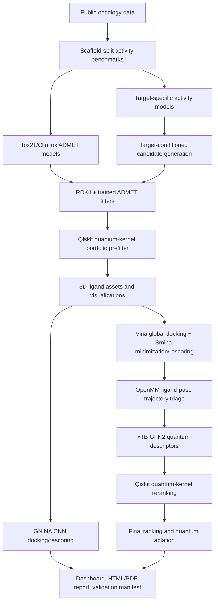

# Q-AI Cancer Drug Discovery Platform

Quantum-augmented AI research pipeline for oncology hit discovery across EGFR, PARP1, and PIK3CA.

This repository converts the original notebook work and the project process PDF into a package-based, CMake-orchestrated research system. It is designed to produce reproducible computational candidate hypotheses, not therapeutic claims.

## Current Verified Status

Last validated locally on Windows with WSL:

- Vina: available through WSL, smoke-tested with mini docking.
- Smina: available through WSL, smoke-tested with mini docking.
- GNINA: available through WSL with CUDA/cuDNN runtime libraries, smoke-tested with CNN score-only and run on top candidates.
- OpenBabel: available through WSL, smoke-tested for SDF/PDBQT conversion.
- xTB: available through WSL, smoke-tested with a real GFN2 single-point calculation.
- RDKit, OpenMM, Qiskit, py3Dmol, FastAPI: installed in the Python research environment.
- Full cached research run completed under CMake.
- Reusable trained models are saved under `models/activity/` and `models/admet/`.
- Early Qiskit statevector quantum-kernel portfolio prefiltering is active before docking/QM.
- Real GNINA CPU CNN docking/rescoring is available from CMake, CLI, and the dashboard for top candidates.
- Unit tests pass.
- Proof-tier artifact validation passes with warnings for ADMET endpoint quality and exploratory binding boxes.
- Production-tier artifact validation now passes with warnings after real Vina/Smina docking and OpenMM trajectory artifacts are generated.

Main report:

```text
outputs/cancer_proof_v1/report.html
outputs/cancer_proof_v1/report.pdf
```

Current local servers, when launched:

```text
http://127.0.0.1:8000/dashboard
http://127.0.0.1:8010/report.html
http://127.0.0.1:8000/docs
```

## One-Command Workflows

Full research workflow with data download/cache, setup, tool checks, pipeline run, report rebuild, and proof-tier validation:

```powershell
cmake --workflow --preset research
```

Install or repair WSL tools first, then run the full research workflow:

```powershell
cmake --workflow --preset research-bootstrap
```

Run from cached datasets:

```powershell
cmake --workflow --preset offline-research
```

Download datasets and train only the reusable activity plus ADMET models into `models/`:

```powershell
cmake --workflow --preset train-models
```

Run GNINA CNN docking/rescoring on the current top candidates:

```powershell
cmake --workflow --preset run-gnina
```

Fast local smoke workflow with fewer generated molecules:

```powershell
cmake --workflow --preset quick-research
```

Open the report and API after a cached run:

```powershell
cmake --workflow --preset show
```

Open only the dashboard frontend:

```powershell
cmake --build --preset serve-dashboard
```

Run unit tests plus proof-tier artifact validation:

```powershell
cmake --workflow --preset test-all
```

## Setup Details

Install Python research extras:

```powershell
pip install -e ".[research]"
```

Install or repair WSL tools:

```powershell
cmake --preset default
cmake --build --preset install-tools
```

For non-interactive sudo, set `WSL_SUDO_PASSWORD` only in the current shell session. Do not commit credentials.

Manual tool checks:

```powershell
python scripts/verify_external_tools.py --strict
python scripts/smoke_external_tools.py
```

## Pipeline



## What Is Real Today

The active run includes:

- Public dataset retrieval and caching for ChEMBL, PubChem, RCSB/AlphaFold structures, Tox21, and ClinTox.
- Scaffold-split model training for EGFR, PARP1, and PIK3CA.
- Trainable Tox21/ClinTox ADMET classifiers saved in `models/admet/` and used in filtering/ranking.
- Early Qiskit statevector quantum-kernel prefiltering over filtered candidates, used to prioritize the docking portfolio and final ranking.
- Reference-inhibitor rediscovery metrics.
- Target-conditioned candidate generation and filtering.
- RDKit 2D/3D ligand assets and molecule galleries.
- Real AutoDock Vina global docking for 300 selected candidates, with prepared PDBQT receptors/ligands, pose outputs, logs, and Smina local minimization/rescoring.
- Real OpenMM CPU trajectory artifacts for the top 10 docked candidates per target.
- Real GNINA CPU CNN docking/rescoring for the top candidate per target, with SDF pose artifacts and live dashboard logs.
- Real xTB GFN2 single-point calculations for top candidates.
- Real Qiskit statevector quantum-kernel reranking.
- AlphaFold receptor structures for EGFR/PARP1/PIK3CA are served to the dashboard 3D viewer.
- Legacy ADA/ALDR/CAH2/TRY1/TRYB1 AlphaFold structures are kept under `data/structures_havetosee/` for review only.
- Final ranking with quantum ablation columns.
- HTML/PDF report generation.
- Tool manifests, smoke-test manifests, model cards, run manifests, validation reports.

The current proof run produced:

```text
benchmark_records: 2542
generated_candidates: 15000
filtered_candidates: 1500
docking_rows: 300
docking_real: true
md_rows: 30
md_real: true
qm_rows: 30
qml_rows: 30
gnina_rows: 3
ranked_rows: 300
```

## Current Limitations

Production validation now passes, but this is still computational research evidence rather than therapeutic validation.

- Vina/Smina/OpenBabel are installed, smoke-tested, and used in the main docking table. The current receptor boxes are still exploratory receptor-centroid boxes until binding-pocket centers are curated from co-crystal structures or literature.
- GNINA is installed and artifact-backed for selected top candidates, but it uses the same exploratory receptor-centroid boxes.
- OpenMM is active and writes trajectory artifacts for docked ligand poses. It is a real OpenMM ligand-pose relaxation/stability screen, not an explicit-solvent, fully parameterized protein-ligand MD/FEP workflow.
- xTB and Qiskit are active in the main run and are validated by the proof-tier gate.

Use:

```powershell
python scripts/validate_research_artifacts.py --project outputs/cancer_proof_v1 --tier proof
```

The stricter gate is:

```powershell
python scripts/validate_research_artifacts.py --project outputs/cancer_proof_v1 --tier production
```

The production gate should now return `pass_with_warnings`. Remaining warnings are intentionally retained for ADMET endpoint quality and curated binding-pocket work.

## Key Outputs

```text
data/processed/oncology_benchmark.csv
data/processed/reference_inhibitors.csv
models/activity/
models/admet/
outputs/cancer_proof_v1/generated.csv
outputs/cancer_proof_v1/filtered.csv
outputs/cancer_proof_v1/assets/ligand_asset_manifest.csv
outputs/cancer_proof_v1/docking/results.csv
outputs/cancer_proof_v1/gnina/results.csv
outputs/cancer_proof_v1/gnina/poses/
outputs/cancer_proof_v1/md/stability.csv
outputs/cancer_proof_v1/qm/qm_descriptors.csv
outputs/cancer_proof_v1/qml/quantum_prefilter_scores.csv
outputs/cancer_proof_v1/qml/quantum_kernel_scores.csv
outputs/cancer_proof_v1/models/admet_model_metrics.csv
outputs/cancer_proof_v1/final_ranked_candidates.csv
outputs/cancer_proof_v1/top_candidates.csv
outputs/cancer_proof_v1/report.html
outputs/cancer_proof_v1/report.pdf
outputs/cancer_proof_v1/validation_report.json
```

## Research Architecture

Read:

```text
docs/research_architecture.md
docs/sota_review.md
references.bib
```

The architecture tracks active components and near-term SOTA integrations:

- Biomolecular complex prediction: AlphaFold 3, RoseTTAFold All-Atom, Chai-1, Boltz-1.
- Docking and rescoring: AutoDock Vina, Smina/Vinardo, DiffDock, GNINA.
- Molecular representation: Uni-Mol and 3D pretrained molecular encoders.
- Generative chemistry: REINVENT4 and diffusion/fragment-constrained generators.
- ADMET and toxicity: local Tox21/ClinTox models now, ADMET-AI/ADMETlab-style breadth as comparison targets.
- Molecular dynamics: OpenMM 8 and future parameterized trajectories.
- Quantum chemistry: xTB GFN2 now, optional DFT/Psi4 refinement next.
- Quantum AI: Qiskit quantum kernels now, classical ablations and hardware-aware backends next.
- GNINA: installed through the WSL setup path, smoke-tested, runnable as `cmake --workflow --preset run-gnina`, and surfaced in the dashboard with live logs plus docked-pose visualization.

## Direct CLI

Run the full package entrypoint:

```powershell
python -m q_ai_drug.cli run-cancer-proof --config configs/cancer_targets.yaml
```

Use cached data:

```powershell
python -m q_ai_drug.cli run-cancer-proof --config configs/cancer_targets.yaml --skip-download
```

Rebuild only the report:

```powershell
python -m q_ai_drug.reporting.build_report --project outputs/cancer_proof_v1 --config configs/cancer_targets.yaml
```

Train reusable models only:

```powershell
python scripts/train_research_models.py --config configs/cancer_targets.yaml
```

Serve the API:

```powershell
python -m uvicorn q_ai_drug.service.api:app --host 127.0.0.1 --port 8000
```

## Research-Use Statement

The ranked molecules are computational candidates. Synthesis, assay validation, ADMET experiments, selectivity profiling, safety studies, and regulatory review are required before any therapeutic claim.
