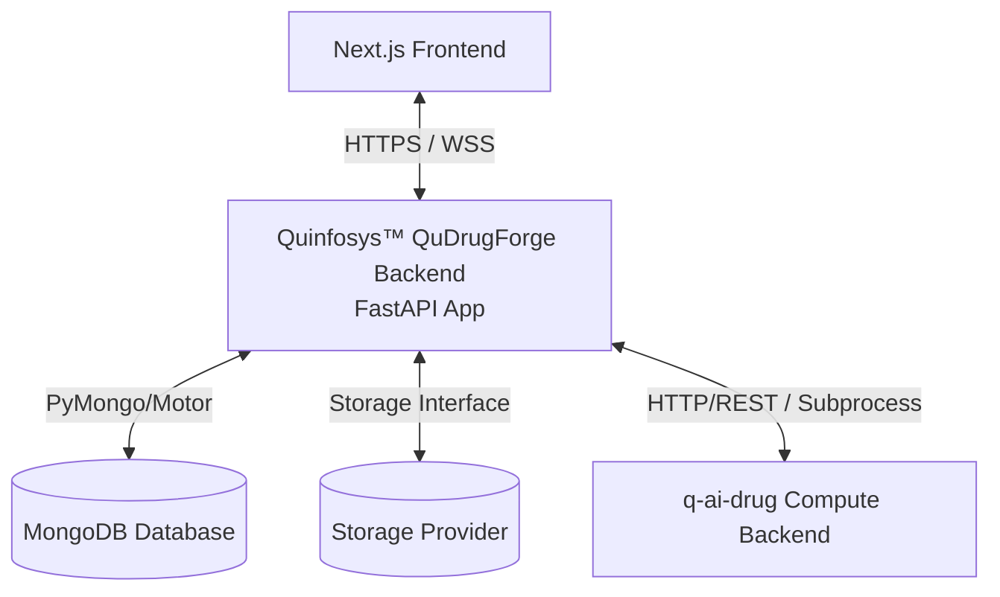

# QuDrugForge™ Backend
> **Quantum AI Drug Discovery Platform - Core Application Server**

QuDrugForge™ is a state-of-the-art Quantum AI Drug Discovery Platform. This repository contains the application backend built with **Python** and **FastAPI**, designed to coordinate research workspaces, manage chemical datasets, interface with advanced quantum compute engines, and serve high-fidelity scientific data visualization clients.

---

## 1. Core Purpose & Capabilities

The QuDrugForge™ application backend bridges the Next.js frontend to physical databases, secure binary file stores, and external high-performance GPU simulation clusters. It acts as the central coordinator for:
* **Governance**: Secure workspace collaboration, compliance logs, and credential routing.
* **Chemical Data Ingestion**: Storage registry tracking physical proteins (PDB) and candidate molecular ligands (SDF/CSV).
* **Research Workspace Orchestration**: Launching AutoDock Vina, deep learning (GNINA) CNN poses, density functional theory (DFT) descriptor predictions, and ADMET toxicity profiling.
* **Orchestration & Automation**: Triggering sequential pipeline runs, polling statuses, and importing artifacts dynamically.
* **Science Translators**: Standardizing massive scientific outputs into rich, interactive visualization payloads (used in 3D chemical workspaces and dimensional chemical spaces).

---

## 2. Architectural Summary

QuDrugForge relies on a strictly structured decoupled architecture:



* **Application Backend** (This Repository): Houses user states, workspace parameters, metrics histories, file metadata catalogs, and acts as the gatekeeper.
* **Compute Engine** (`q-ai-drug` - External): An autonomous scientific compute cluster running intensive simulation tasks. **The frontend never communicates directly with the compute engine.**
* **Orchestrator Service**: Manages multi-stage background queues sequentially, transitioning through `queued` ➔ `running` ➔ `importing_results` ➔ `completed`/`failed` states non-blockingly using FastAPI background tasks.
* **Structured Data** (MongoDB): Holds JSON-native schemas representing molecular properties, workspace metrics, and configuration profiles.
* **Abstracted File Store**: Multi-cloud driver abstraction managing file binaries (`uploads`, `artifacts`, `reports`, `temp`) across local directories or enterprise cloud buckets (S3, Cloudflare R2, MinIO, Azure Blob).

---

## 3. Directory Layout

The codebase implements a clean, modular DDD (Domain-Driven Design) and Repository-Service pattern hierarchy:

```text
qudrugforge-backend/
├── app/
│   ├── main.py                     # Main application entrypoint & routing setup
│   ├── core/                       # App lifecycle settings, databases, and logs
│   │   ├── config.py               # Pydantic environment configurations
│   │   ├── database.py             # MongoDB Motor clients hooks
│   │   ├── security.py             # Password hashing and JWT generation
│   │   ├── logging.py              # Centralized logging formatters
│   │   └── exceptions.py           # Structured error handling handlers
│   ├── api/                        # HTTP Endpoint controllers
│   │   └── v1/
│   │       ├── router.py           # Master V1 API Router
│   │       └── pipeline.py         # Pipeline orchestration APIs
│   ├── schemas/                    # Pydantic v2 Request/Response models
│   ├── models/                     # MongoDB document models
│   ├── repositories/               # Raw Database CRUD operation abstraction
│   ├── services/                   # Business rules logic orchestrations
│   │   └── pipeline_orchestrator_service.py # Core sequential pipeline logic
│   ├── storage/                    # Binary storage adapters (local, S3, etc.)
│   │   ├── base.py                 # Abstract storage driver contract
│   │   ├── local.py                # Secure local filesystem provider
│   │   └── service.py              # Central storage resolver
│   ├── integrations/               # Communication wrappers for external services
│   │   └── q_ai_drug_execution.py  # q-ai-drug execution adapters (HTTP/subprocess)
│   └── utils/                      # Ephemeral structural helpers
├── storage/                        # Physical developer storage root
├── tests/                          # PyTest automated validation scripts
├── scripts/                        # Dev orchestration utility tools
│   └── demo_pipeline_run.py        # End-to-end pipeline run validation demo script
├── requirements.txt                # System dependencies
└── README.md                       # Repository guide
```

---

## 4. Development Setup

### Step 1: Environment Configuration
Copy the template variables file into a running `.env` file:
```bash
cp .env.example .env
```

### Step 2: Establish Virtual Environment & Install Packages
```bash
# Create environment
python -m venv .venv

# Activate on Windows
.venv\Scripts\activate

# Install dependencies
pip install -r requirements.txt
```

### Step 3: Launch Local Web Server
Start the local FastAPI development server:
```bash
uvicorn app.main:app --reload --port 8001
```

* **Interactive API Schema**: Open [http://127.0.0.1:8001/docs](http://127.0.0.1:8001/docs) in your browser to browse, test, and run available endpoints.
* **System Status Health Check**: Pinging [http://127.0.0.1:8001/health](http://127.0.0.1:8001/health) will confirm storage statuses.

### Step 4: Run Tests & Verification
```bash
# Run backend test suite (124+ cases)
.venv\Scripts\python -m pytest

# Run pipeline execution E2E validation script
.venv\Scripts\python scripts/demo_pipeline_run.py
```

---

## 5. Completed Milestones

* [x] **Phase 0: Foundation Setup**: Provision clean repository frameworks, configuration schemas, storage models, and mapping specifications.
* [x] **Phase 1–9.5**: Auth, workspaces, projects, files, targets, molecules, q-ai-drug read-only, artifact importer, experiments/job tracking.
* [x] **Phase 10: Docking Backend APIs**: Docking run orchestration, MongoDB result APIs, imported q-ai-drug docking support.
* [x] **Phase 11: GNINA Backend APIs**: GNINA run scaffolding, status/log/result routes, pose metadata resolution, imported q-ai-drug GNINA support.
* [x] **Phase 12: Quantum/QML Backend APIs**: Quantum run scaffolding, descriptor/QML/prefilter/reranking result routes, imported q-ai-drug QM/QML support.
* [x] **Phase 13: ADMET Backend APIs**: ADMET run orchestration, results/risk-table/summary routes, frontend-friendly risk formatting, and imported q-ai-drug ADMET support.
* [x] **Phase 14: Molecular Dynamics (MD) & Simulations APIs**: Simulation trajectories, RMSD/RMSF results tracking, stability scores and charts.
* [x] **Phase 16: Reports Engine**: PDF/HTML compiled dossiers compilation and dynamic download hooks.
* [x] **Phase 20: Full Orchestration & Compute Execution Adapters**: Full background multi-stage execution sequential loop, auto-importer triggers, HTTP client + subprocess command executors, and E2E polling handlers.

---

## 6. Phase 20 — Pipeline Orchestration

Phase 20 integrates all classical, ML, quantum, simulation, and report steps into an automated, sequential pipeline managed dynamically using FastAPI background tasks.

### Orchestration Endpoints

| Method | Path | Description |
|--------|------|-------------|
| `POST` | `/api/v1/projects/{project_id}/pipeline/run` | Enqueue and start a multi-stage sequential run |
| `GET` | `/api/v1/projects/{project_id}/pipeline/summary` | Get latest run status, stage progression, and reports |

### Sequential pipeline body format:
```json
{
  "pipeline": [
    "target_ranking",
    "molecule_generation",
    "filtering",
    "docking",
    "gnina",
    "quantum",
    "admet",
    "simulation",
    "report"
  ],
  "parameters": {}
}
```

### Features Verified:
* **Execution Adapters**: Exponential client probes to `http://127.0.0.1:8000` with direct local subprocess fallback executing native shell command lines cleanly.
* **Auto-Import Triggers**: Automatically executes `ArtifactImportService` upon stage completion to index files, update molecule parameters, and compile reports.
* **Live Long-Polling & Stepper**: Exposes summary counts and stepper state arrays mapping backend tasks to active UI indicators.
