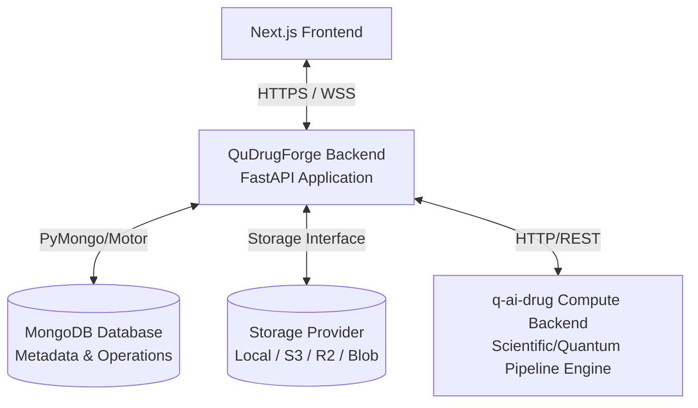

# QuDrugForge™ System Architecture

This document details the architectural layout, system component interaction, and design patterns for the QuDrugForge™ Quantum AI Drug Discovery platform backend.

---

## 1. High-Level Architectural Flow

---

## 2. System Components & Separation of Concerns

### A. QuDrugForge Backend (This Repository)
* **Role**: Primary application orchestrator.
* **Responsibilities**:
  * User authentication, workspace authorization, and project management.
  * Storing and querying metadata, parameters, targets, molecules, simulation jobs, and audit logs.
  * Ingestion, validation, and serving of physical scientific files via a unified storage abstraction.
  * Translating and dispatching intensive computational tasks to the compute engine (`q-ai-drug`).
  * Adapting, parsing, and caching scientific results from `q-ai-drug` into structured database records.

### B. q-ai-drug Compute Backend (External)
* **Role**: Computational core and simulation engine.
* **Responsibilities**:
  * Docking calculations (AutoDock Vina, GNINA).
  * Quantum mechanics calculations (DFT descriptors, electrostatic potentials).
  * Quantum Machine Learning (QML) screening models.
  * ADMET prediction scoring and molecular generation pipelines.
* **Note**: The **frontend never communicates directly with the q-ai-drug compute backend**. All traffic must pass through the QuDrugForge application backend for authorization, rate limiting, logging, and state synchronization.

---

## 3. Data Storage & Strategy Partitioning

### A. Structured Metadata (MongoDB)
* **Goal**: Extreme query performance, flexible document schemas for scientific outputs, and seamless expansion.
* **Content**: Users, teams, workspaces, projects, inputs config, file metadata (paths, sizes, hashes), molecular SMILES records, experiment definitions, parameters, status, and job logs.
* **Rule**: **Never store raw large binary files** (e.g., PDB, SDF, SDF pose, MD trajectories, HTML/PDF reports) directly in MongoDB documents. Use storage references instead.

### B. Scientific File Storage (Storage Provider Abstraction)
* **Goal**: Abstract physical storage access to support infrastructure-agnostic scaling.
* **Folder Hierarchy in Development**:
  * `storage/uploads/`: Original protein structure files (PDB/PDBQT), chemical libraries (SDF/CSV), and ligand maps.
  * `storage/artifacts/`: Output poses, 3D chemical conformation structures, density grid logs, and intermediate quantum files.
  * `storage/reports/`: Generated PDF/HTML analytical summaries.
  * `storage/temp/`: Ephemeral workspace for job packaging and unpackaged compute archives.

---

## 4. Storage Provider Abstraction & Future Migration

To prevent infrastructure lock-in, QuDrugForge uses a dedicated `StorageService` interface. Code interacting with scientific files must use this service instead of direct `os` or `pathlib` filesystem commands.

### Supported Providers (Current & Future):
1. **Local Filesystem** (`local`): Used for local development and unit tests. Files are saved inside a configurable directory on the local system (e.g., `./storage`).
2. **Amazon S3** (`s3`): For enterprise cloud deployments in AWS.
3. **Cloudflare R2** (`r2`): S3-compatible, zero-egress fee object storage.
4. **MinIO** (`minio`): S3-compatible, on-premise containerized storage for private drug discovery deployments.
5. **Azure Blob Storage** (`azure`): For enterprise cloud deployments in Microsoft Azure.

> [!NOTE]
> All storage migrations can be completed purely via environment configuration (`STORAGE_PROVIDER`) and supplying matching credentials in `.env`, without altering a single line of domain/business logic.
