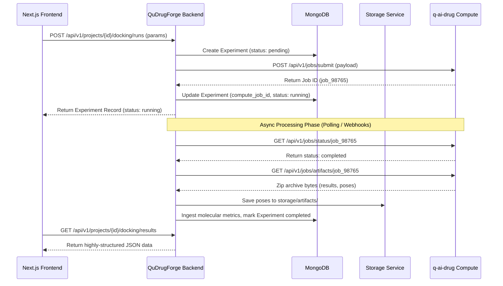

# QuDrugForge™ Compute Integration Plan: `q-ai-drug`

This document details the interface architecture, communication flow, and integration strategies connecting the QuDrugForge™ application backend to the external `q-ai-drug` scientific compute backend.

---

## 1. Architectural Strategy

To maintain a clean division of labor and security boundaries:
1. **No Direct Frontend-to-Compute Communication**: The frontend has zero awareness of the external `q-ai-drug` network address, authorization keys, or internal API structures.
2. **Encapsulation & Translation**: The QuDrugForge backend serves as a gatekeeper, translating user-friendly workspace interactions into heavy scientific workloads, and returning normalized, standardized responses.
3. **Async Processing & Telemetry**: Since computational docking, DFT calculations, and simulations can run for hours, the integration operates asynchronously via task states, callbacks, and polling patterns.

---

## 2. Planned Integration Modes

### Mode 1: Infrastructure Health Check
* **Objective**: Periodically monitor compute cluster availability.
* **Mechanism**: Handled via `GET /api/v1/integrations/q-ai-drug/health`. The backend pings the health endpoint of `q-ai-drug` to inspect GPU/CPU loading status, active job queues, and container health.

### Mode 2: Read-Only Result Adapter
* **Objective**: Standardize response contracts for client consumption.
* **Mechanism**: Translates the raw, matrix-heavy outputs of `q-ai-drug` mathematical nodes into clean, serializable JSON formats consumable by React charts, tables, and 3D protein visualization canvases.

### Mode 3: Artifact Importer
* **Objective**: File lifecycle consolidation.
* **Mechanism**: Downloads compute outputs (e.g. ligand pose libraries, dynamic trajectories), validates integrity checksums, parses structural files for metrics, and files them away inside our designated `StorageService`.

### Mode 4: Experiment/Job Orchestration
* **Objective**: State monitoring and lifecycle tracking.
* **Mechanism**: Tracks pending, running, completed, and failed states of scientific executions, storing runtime logs and exception stacktraces in MongoDB `experiments` records for analytical auditing.

### Mode 5: Full Pipeline Execution
* **Objective**: Run complex multi-stage tasks.
* **Mechanism**: Chains docking, deep-learning scoring, quantum density calculations, and ADMET predictions into unified pipeline operations, passing intermediate results automatically from one stage to the next.

---

## 3. Planned Scientific Outputs & Import Mappings

When a job completes, QuDrugForge will ingest and index the following outputs from `q-ai-drug`:

| Target File | Scientific Context | DB Collection Mapping | Storage Destination |
| :--- | :--- | :--- | :--- |
| `generated.csv` | Initial AI-generated molecular libraries | `molecules` | `storage/temp/` (ingested) |
| `filtered.csv` | Pre-filtered structures based on ADMET boundaries | `molecules` (updates) | `storage/temp/` |
| `docking/results.csv` | AutoDock Vina binding scores & parameters | `docking_results` | `storage/artifacts/` |
| `gnina/results.csv` | CNN-scoring metrics and affinity thresholds | `gnina_results` | `storage/artifacts/` |
| `gnina/poses/` | Conformation coordinates (SDF format) for 3D views | `files` (with metadata references) | `storage/artifacts/` |
| `qm/qm_descriptors.csv` | Quantum descriptors (HOMO/LUMO bandgaps) | `quantum_results` | `storage/artifacts/` |
| `qml/quantum_prefilter_scores.csv`| Classical-quantum hybrid initial screen | `quantum_results` (updates) | `storage/artifacts/` |
| `qml/quantum_kernel_scores.csv` | Deep quantum kernel metrics | `quantum_results` (updates) | `storage/artifacts/` |
| `final_ranked_candidates.csv` | Consolidated priority lists | `molecules` (ranks) | `storage/artifacts/` |
| `top_candidates.csv` | Elite drug candidates shortlisted for dynamic test | `molecules` | `storage/artifacts/` |
| `models/admet_model_metrics.csv` | Endpoint-level ADMET model quality metrics | `admet_results` / docs summary | `storage/artifacts/` |
| `report.pdf` / `report.html` | Analytical study sheets and research portfolios | `reports` & `files` | `storage/reports/` |

### ADMET Fallback and Safety Notes

For Phase 13 ADMET support, the backend importer treats `filtered.csv`, `final_ranked_candidates.csv`, `top_candidates.csv`, and `models/admet_model_metrics.csv` as the stable fallback set when direct compute routes are unavailable. The importer keeps the raw rows intact, derives missing overall risk and recommendation values, and only materializes ADMET records when actual ADMET signal is present.

All ADMET screening outputs are computational estimates intended for prioritization and review. They are not clinical safety guarantees and should not be interpreted as a replacement for experimental validation or regulatory assessment.
