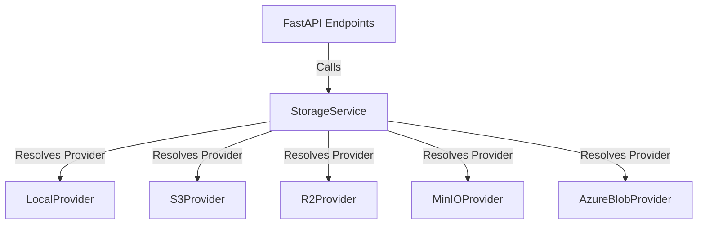

# QuDrugForge™ Storage Strategy & Plan

This document details the file storage strategy, path layouts, storage service abstractions, and migration steps for QuDrugForge™.

---

## 1. Storage Partitioning Strategy: MongoDB vs. Binary Store

To guarantee scalability and peak database performance, we enforce a strict separation of concerns between raw file content and system metadata.

### A. The Core Database Golden Rule
> [!IMPORTANT]
> **MongoDB must never store large scientific files or binary file payloads.**
> Avoid GridFS where possible to bypass database connection overhead and complex retrieval streams. Instead, files are held inside the abstracted File Store.

### B. What Stores Where
* **MongoDB Collections (`files`)**:
  * File unique identifier (`UUID`)
  * Relationship markers (`project_id`, `workspace_id`, `uploaded_by`)
  * Display filename (`filename`)
  * Classification tag (`file_type`)
  * Relative reference path (`storage_path`)
  * Integrity checksum (`checksum` - SHA256)
  * File size (`size_bytes`)
  * Operational timelines (`created_at`)
* **Abstracted File Store**:
  * The actual byte streams representing structures (PDB, PDBQT, SDF, MOL2, FASTA), poses (SDF, PDBQT), dynamics trajectories (DCD, XTC), or client-facing formats (HTML, PDF, CSV, PNG).

---

## 2. Directory Structures in Development

During local development, files are written to the local disk inside the path set by `LOCAL_STORAGE_ROOT` in your `.env` (defaults to `./storage`).

Within this root, the following directories are structured:

| Directory | Content Category | Write Operations | Cleanup Rules |
| :--- | :--- | :--- | :--- |
| `storage/uploads/` | User-uploaded files (proteins, target models, known ligand lists) | Written on HTTP Upload | Persistent (User-deleted) |
| `storage/artifacts/` | Simulation outputs, docking poses, density grids, model predictions | Generated by backend/compute ingestion | Persistent (User-deleted) |
| `storage/reports/` | Summarized PDF and HTML export packages | Export service generations | Persistent |
| `storage/temp/` | Fragmented chunks, zip file extracts, intermediate calculations | Temporary working operations | Auto-cleaned after task completes |

---

## 3. Storage Abstraction Layer

API endpoints, integrations, and services **must never access the raw host filesystem directly** (using `open()`, `os.mkdir()`, or `shutil`). They must perform all mutations through the `StorageService` interface.

### Abstract base interface (`app/storage/base.py`)
```python
from abc import ABC, abstractmethod
from typing import AsyncGenerator, BinaryIO

class BaseStorageProvider(ABC):
    @abstractmethod
    async def upload_file(self, destination_path: str, file_obj: BinaryIO) -> str:
        """Uploads a file object and returns its resolved path or URL."""
        pass

    @abstractmethod
    async def download_file(self, source_path: str) -> AsyncGenerator[bytes, None]:
        """Downloads a file in chunks."""
        pass

    @abstractmethod
    async def delete_file(self, target_path: str) -> bool:
        """Removes the file from storage."""
        pass

    @abstractmethod
    async def exists(self, target_path: str) -> bool:
        """Checks if a path exists."""
        pass
```

---

## 4. Multi-Cloud Provider Roadmaps

By abstracting these operations, moving QuDrugForge to a cloud environment involves creating a class inheriting from `BaseStorageProvider` and updating the environment variables:



### Future Integration Blueprints

* **AWS S3** (`s3`):
  * **Engine**: Utilizes `aioboto3` or `aiobotocore` for non-blocking file streaming.
  * **Config**: Requires `AWS_ACCESS_KEY_ID`, `AWS_SECRET_ACCESS_KEY`, `AWS_S3_BUCKET`, `AWS_REGION`.
* **Cloudflare R2** (`r2`):
  * **Engine**: Fully S3-compliant. Built using the standard S3 provider while overriding the endpoint target URL.
  * **Config**: Requires `CF_R2_ACCOUNT_ID`, `CF_R2_ACCESS_KEY_ID`, `CF_R2_SECRET_ACCESS_KEY`, `CF_R2_BUCKET`.
* **MinIO** (`minio`):
  * **Engine**: Essential for security-focused, on-premise private clouds. Built using the standard S3 provider pointing to the local network port.
  * **Config**: Requires `MINIO_ENDPOINT`, `MINIO_ACCESS_KEY`, `MINIO_SECRET_KEY`, `MINIO_BUCKET`.
* **Azure Blob Storage** (`azure`):
  * **Engine**: Utilizes `azure-storage-blob` async library.
  * **Config**: Requires `AZURE_STORAGE_CONNECTION_STRING`, `AZURE_CONTAINER_NAME`.
